# 🌙 MoonChat

MoonChat is a modern, AI-powered social and financial application designed for the crypto community. It combines real-time messaging with cryptocurrency tracking and an intelligent AI assistant to provide a seamless decentralized-themed experience.

---

## 🚀 Key Features

- **Real-time Messaging:** Secure and fast communication using Firebase Firestore.
- **Crypto Track:** Monitor real-time cryptocurrency prices, market caps, and 24h changes powered by the CoinGecko Library.
- **AI Chatbot Assistant:** An integrated AI assistant to help users navigate the app and get quick information.
- **Authentication:** robust signup/login system with Google Sign-In support.
- **Password Recovery:** Seamless "Forgot Password" and internal "Change Password" flows via Firebase Auth.
- **Profile Management:** Fully customizable profiles including bio, gender, and date of birth.

---

## 🛠️ Tech Stack

### Frontend
- **Framework:** Flutter
- **State Management:** Get
- **Authentication:** Firebase Auth & Google Sign-In
- **Database:** Cloud Firestore
- **Animations:** Lottie

### Backend
> **Note:** The backend has been migrated to a new, standalone repository.
- **Framework:** Flask (Python)
- **APIs:** CoinGecko Library for Crypto Data
- **AI/ML:** TensorFlow, NLTK, NumPy, Pandas (for Chatbot logic)


### Screenshots

<p align="center">
  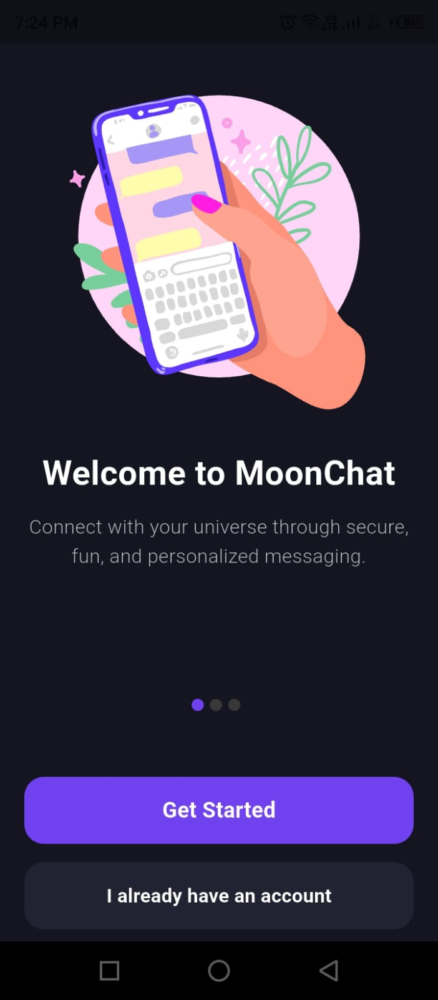
  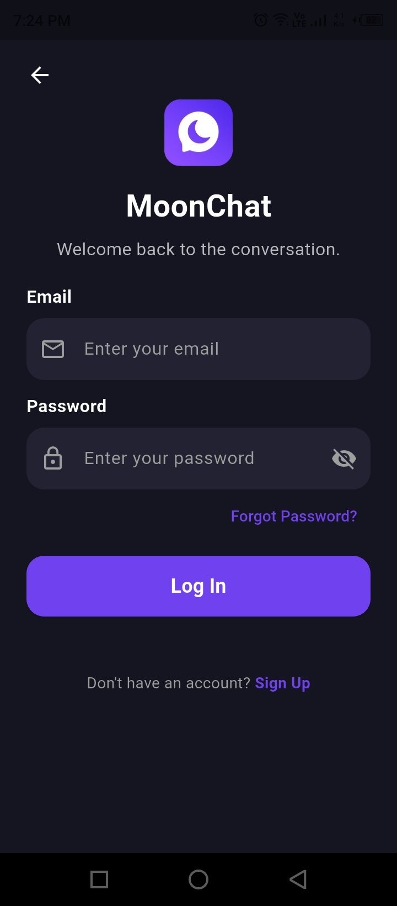
  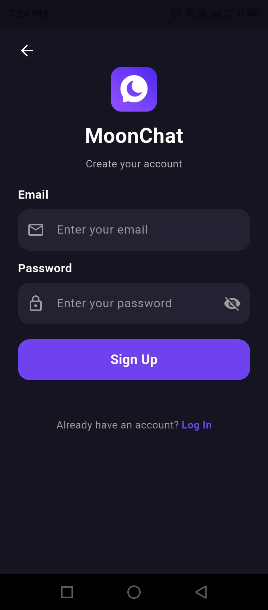
</p>
<p align="center">
  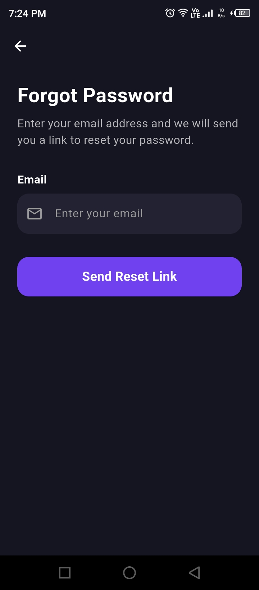
  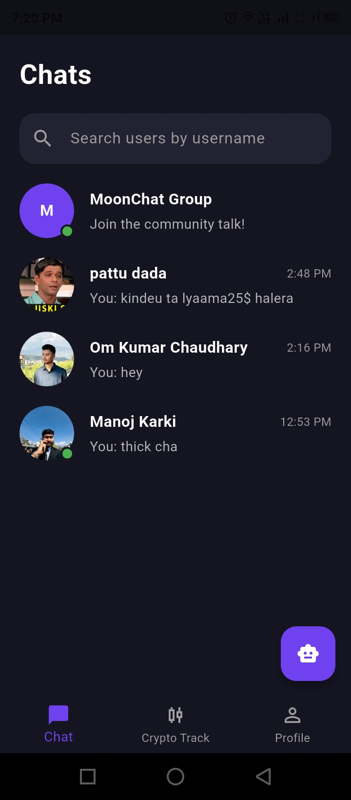
  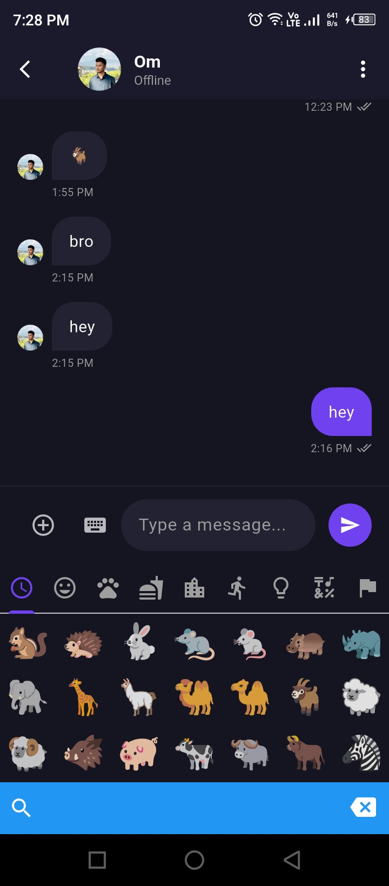
</p>
<p align="center">
  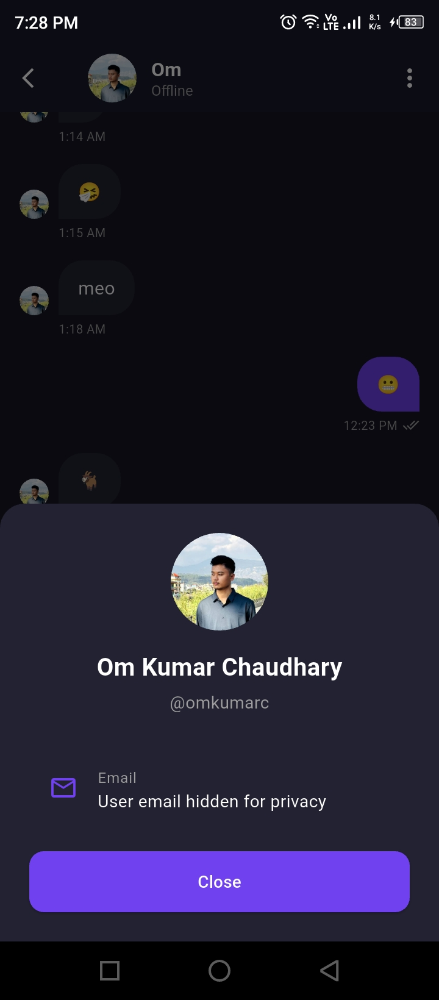
  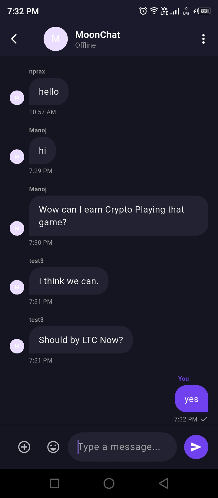
  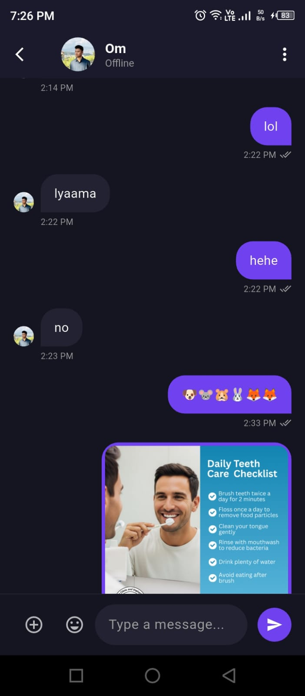
</p>
<p align="center">
  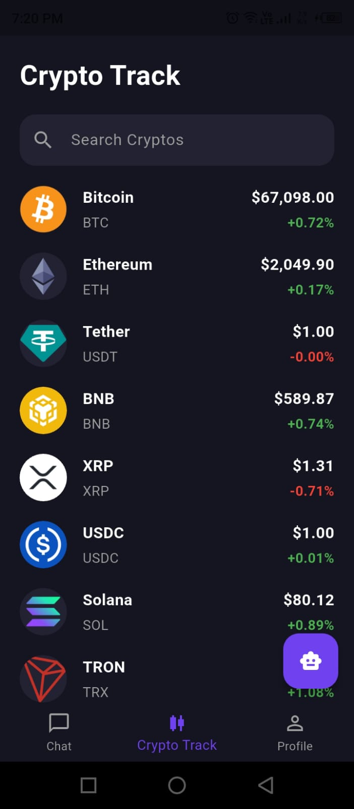
  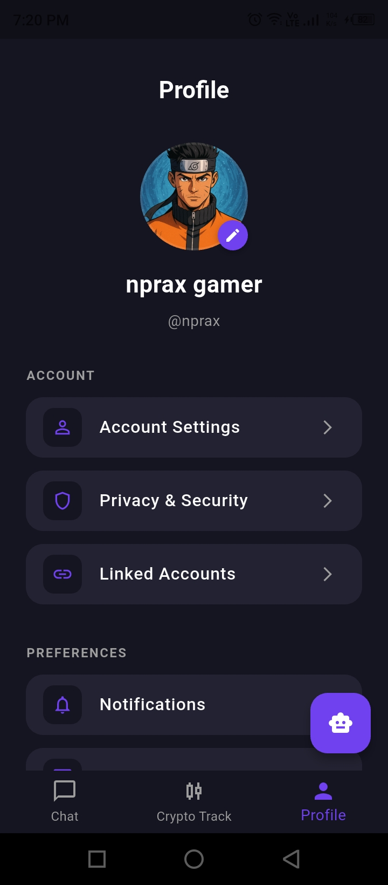
  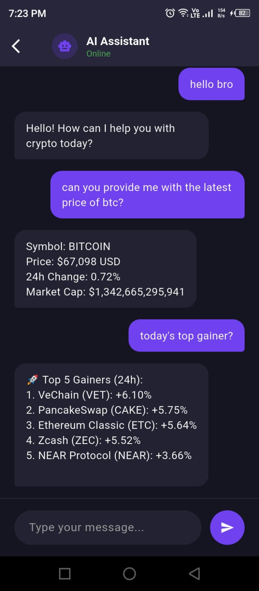
</p>
<p align="center">
  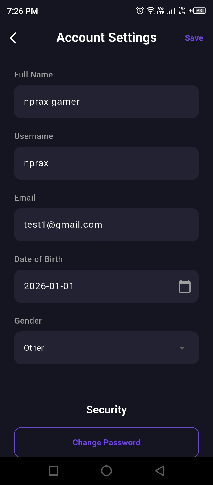
  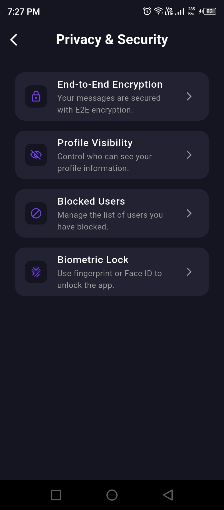
  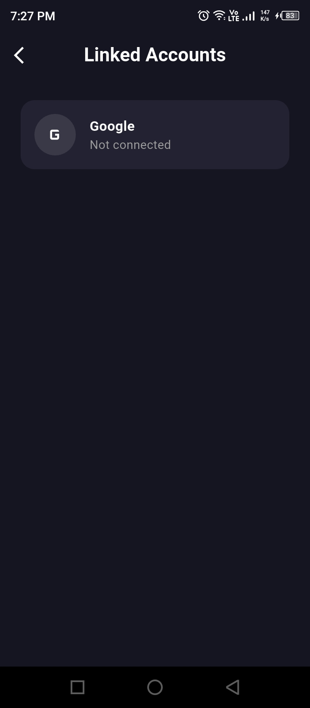
</p>
<p align="center">
  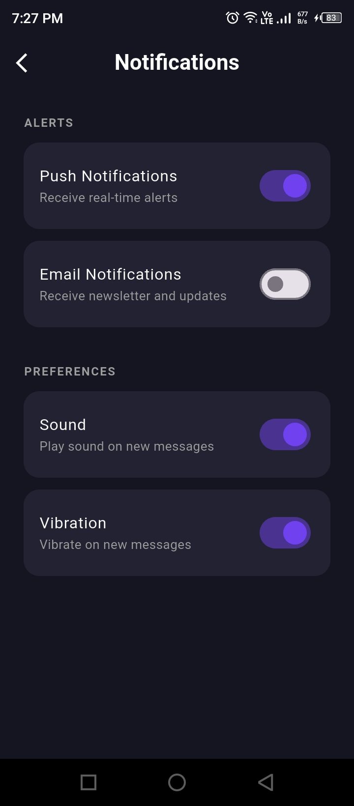
  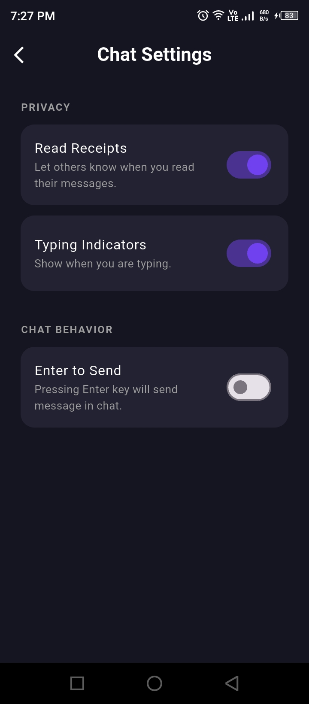
  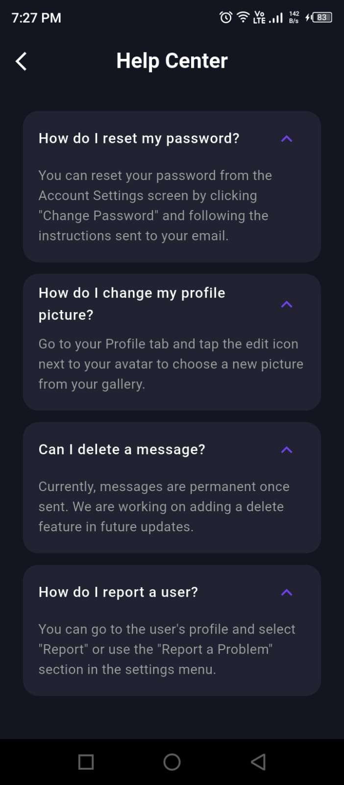
</p>
<p align="center">
  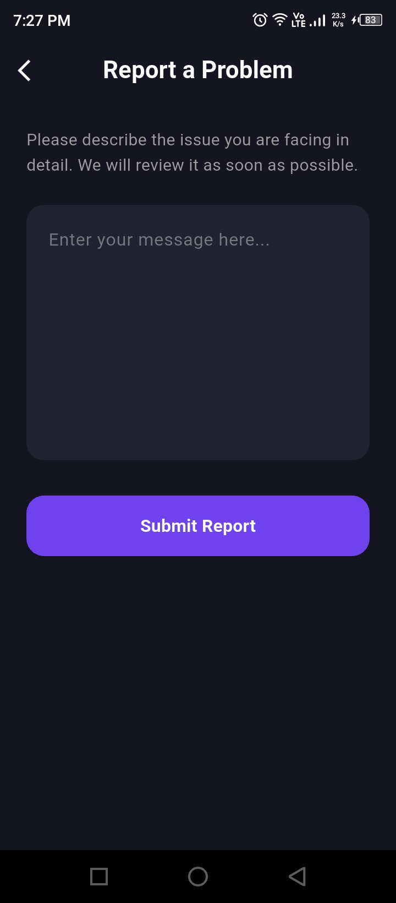
  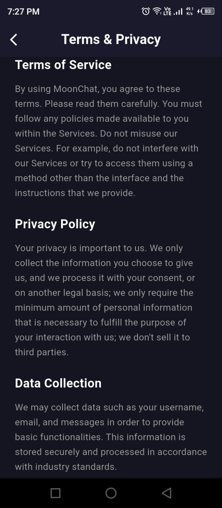
  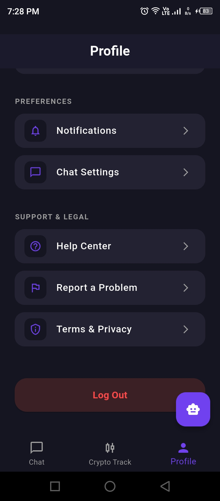
</p>


### Demo Video

<p align="center">
  <a href="https://drive.google.com/file/d/18mSveKjDQOlVe828c6_usRApBpHPePc0/preview" target="_blank">
    
  </a>
</p>


---

## 📥 Getting Started

### Prerequisites
- [Flutter SDK](https://docs.flutter.dev/get-started/install)
- [Python 3.x](https://www.python.org/downloads/)
- [Firebase account](https://firebase.google.com/) configured for the project

### 1. Backend Setup
1. Navigate to the `backend` directory:
   ```bash
   cd backend
   ```
2. Install dependencies:
   ```bash
   pip install -r requirements.txt
   ```
3. Run the Flask server:
   ```bash
   python app.py
   ```
   *The server will start at `http://localhost:5000`.*

### 2. Frontend Setup
1. Navigate to the root directory:
   ```bash
   cd MoonChat
   ```
2. Fetch Flutter packages:
   ```bash
   flutter pub get
   ```
3. Run the application:
   ```bash
   flutter run
   ```

---

## 📂 Project Structure

- `lib/`: Main Flutter application source code.
  - `screens/`: UI screens (Chat, Auth, Crypto, Profile).
  - `models/`: Data models for User and Chat.
  - `services/`: Backend API and Firebase service classes.
- `backend/`: Flask server and AI logic.
  - `routes/`: API blueprints (Crypto, Chatbot).
  - `chatbot/`: AI model processing logic.
- `images/`: Static assets and animations.

---

## 🔄 Recent Updates

### 📅 April 2026
- **Backend Migration:** A new backend repository has been created. The backend was containerized and deployed to Hugging Face Spaces using Docker.
- **Authentication:** Implemented token-based authentication flow and fixed login persistence issues across app sessions.
- **Notifications:** Integrated Firebase Cloud Messaging for robust, customizable push notifications.
- **Settings & Privacy:** Built comprehensive Settings and Privacy UI screens.
- **Performance & Bug Fixes:** Resolved chat screen performance issues (lagging and minor visual bugs), and fixed mobile data loading issues on physical devices.
- **AI Chatbot Enhancements:** Fixed chatbot model training pipeline, improved conversational accuracy, and integrated real-time market data (CoinGecko Library) for detailed entity-aware responses.

### 📅 March 10, 2026
- **Identity:** Standardized project branding as **MoonChat** (corrected previous typos).
- **Security:** Implemented **Forgot Password** recovery screen and **Change Password** feature in settings.
- **AI Integration:** Launched the **AI Chatbot Assistant** accessible via a new Floating Action Button on the Home Screen.
- **Reliability:** Enhanced backend chatbot API with fail-safe fallback responses for offline models.

### 📅 February 15, 2026
- **AI Core:** Integrated AI Assistant backend core logic.
- **Environment:** Added essential libraries (NumPy, Pandas, NLTK, Scikit-learn, Flask, pyttsx3).

### 📅 February 7, 2026
- **Crypto:** Developed Crypto Track screen with real-time CoinGecko integration.
- **Search:** Implemented Crypto Search and Service layers.
- **Models:** Defined Crypto data models.

### 📅 February 1, 2026
- **Messaging:** Developed Real-time Chat Screen and message models.
- **Discovery:** Implemented User Search functionality.

### 📅 January 27, 2026
- **Navigation:** Implemented Home Screen Dashboard and Bottom Navigation.
- **Profile:** Completed Profile Management (Account Settings, Linked Accounts, Profile Setup).
- **Auth:** Developed User Models for Authentication and Login/Logout CRUD.

### 📅 January 24, 2026
- **Animation:** Integrated Lottie animations.
- **UI:** General UI enhancements and styling.

### 📅 January 20, 2026
- **Auth Foundation:** Initial Authentication setup.
- **Onboarding:** Enhanced UI for the Onboarding/Welcome pages.

### 📅 December 14, 2025
- **Project Setup:** Initialized Flutter project environment.
- **Branding:** Configured app name and launcher icons using `flutter_launcher_icons`.
- **Firebase:** Successfully integrated Firebase core services.